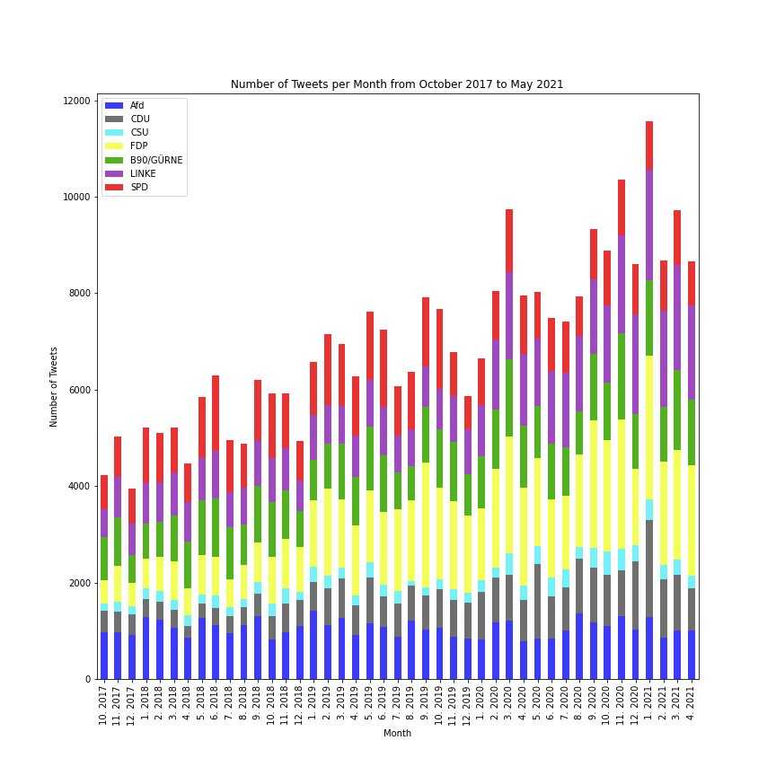

## Party Dataframes
Each Dataframe consists of the 15 politicians from each party who got the most twitter followers. The Collection looks at tweets form the 27th of September 2017 to about the 20th of May 2021.

## Some properties of our Data
We will look at exactly 189 weeks so that theres a set cut off and the scrape time does not influence the result. That means all tweets from 27.09.2017 to 12.05.2021 are taken into consideration.

### Total Number of Tweets
Our Dataset consists of 306.949 Tweets (20.05.2021). The pie-chart displays the distribution of tweets to each party. Here we see that even though CDU and CSU are treated seperatly, they still end up having the smalles Amount of tweets. Thats why the 'Union' (CDU and CSU together) will consist of both. That way each party has a somewhat similar amount of tweets

### Tweets per month

The next diagram displays the number of tweets per party in a specific month. We can see all month, which are complete data. In other words, we start at the 1st of October 2017 and end at the 30th of April 2021

