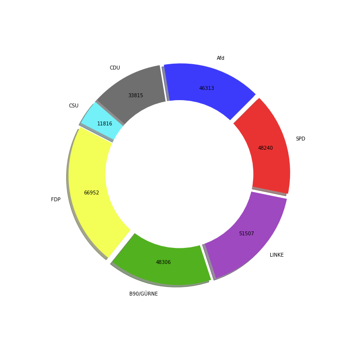

## Party Dataframes
Each Dataframe consists of the 15 politicians from each party who got the most twitter followers. The Collection looks at tweets form the 27th of September 2017 to about the 20th of May 2021.

## Some properties of our Data
We will look at exactly 189 weeks so that theres a set cut off and the scrape time does not influence the result. That means all tweets from 27.09.2017 to 12.05.2021 are taken into consideration.

This pie-chart displays the total number of tweets of each party during the entire interval.